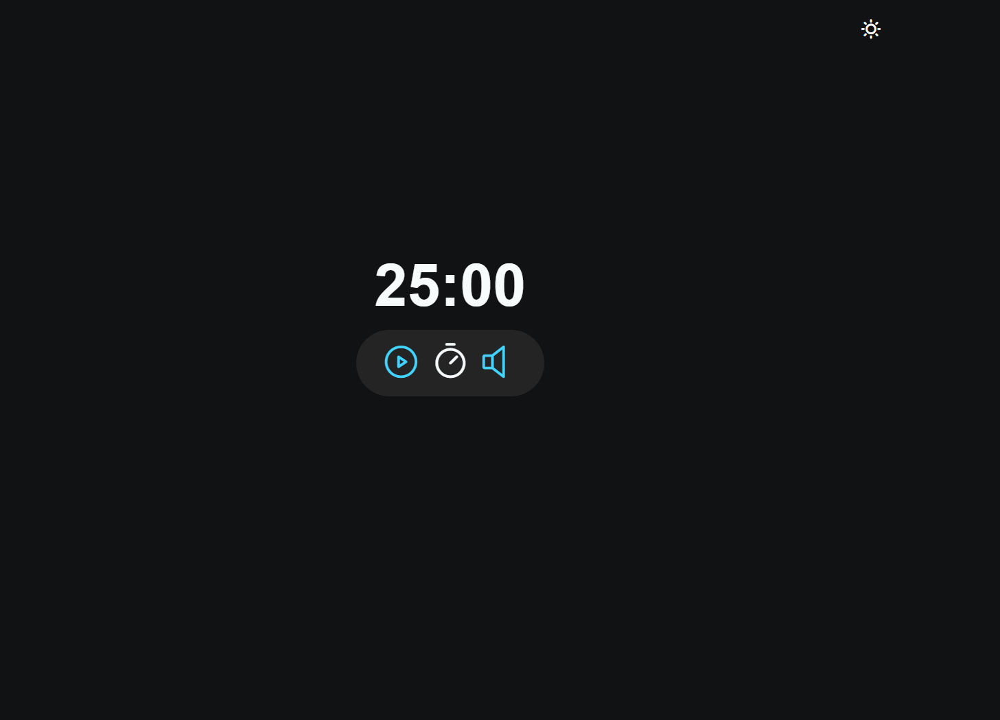
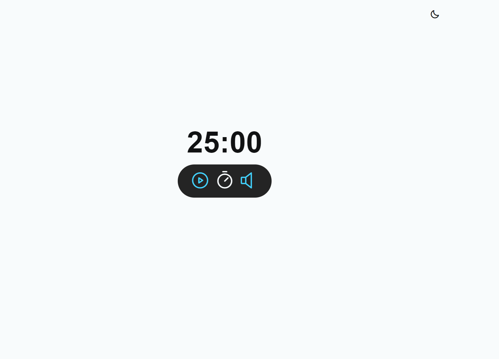

<h2 align="center">Focus Time</h2>
 

     <a href="#-tecnologias">Tecnologias</a> •    
      •
     <a href="#-licença">Licença</a> 

 

Projeto baseado em um temporazidor baseado na técnica de pomodoro, criado na aula do programa Explorer da Rocketseat.

 

## 🌄 Layout

 

 

## 🛠 Tecnologias

Abaixo tecnologias que foram usadas no projeto:

- Html
- Css
- Javascript
- Git e Github
- Vercel

 

## 👨‍💻 Colaboradores

<table>
    <tr>
         <td align="center"><a href="https://brunogoncalvesferreira.com"> <b>Bruno Gonçalves</b></a> <a href="https://brunogoncalvesferreira.com" title="Bruno Gonçalves Ferreira">👨‍🚀</a></td>
    </tr>
</table>

 

## ✅ Licença

[MIT](https://github.com/brunogoncalvesferreira/todolist?tab=MIT-1-ov-file#readme)